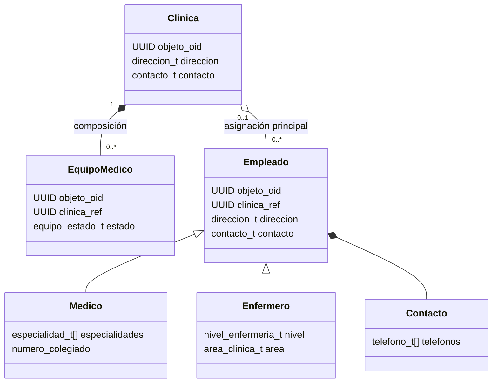

# Modelo objeto-relacional de GlobalHealth

## 1. Alcance

Este modelo implementa la capa lógica objeto-relacional de GlobalHealth Unified
System en PostgreSQL 16. La corporación opera en Costa Rica, Guatemala y Panamá.
El modelo representa clínicas, equipos médicos y dos especializaciones de
empleado: médicos y enfermeros.

PostgreSQL implementa solo una parte del estándar SQL objeto-relacional. La
solución utiliza las capacidades nativas del motor y hace explícitas sus
diferencias:

- Los tipos de valor se implementan con tipos compuestos, dominios y
  enumeraciones.
- Las clases persistentes principales se materializan con tablas tipadas
  (`CREATE TABLE ... OF tipo`).
- La especialización de empleados se implementa con herencia de tablas
  (`INHERITS`). Cada tabla genera, además, su propio tipo compuesto de fila.
- La identidad de objeto se implementa mediante UUID. PostgreSQL 16 ya no
  soporta OID implícito en tablas de usuario.
- Los métodos se implementan como funciones almacenadas cuyo primer argumento
  es el tipo compuesto correspondiente.

## 2. Separación por esquemas

El esquema `gh_tipo` contiene dominios, enumeraciones y tipos compuestos. El
esquema `gh_obj` contiene las tablas que almacenan los objetos, las relaciones,
los métodos y las reglas que necesitan consultar datos persistentes.

Separar definición y persistencia evita colisiones de nombres y permite
inspeccionar de forma clara la relación entre una tabla tipada y el tipo que la
define.

## 3. Identidad y referencias

Todos los objetos persistentes poseen un atributo `objeto_oid` de un dominio
basado en UUID. El UUID es una identidad lógica estable, independiente de la
ubicación física de la fila.

Las referencias utilizan el mismo dominio y se protegen con claves foráneas.
No se usa `ctid`, porque cambia cuando PostgreSQL mueve una versión de la fila,
ni el tipo interno `oid`, porque está destinado principalmente a objetos del
catálogo y no ofrece identidad global suficiente para filas de usuario.

## 4. Tipos de valor

### 4.1. Dirección

`direccion_t` usa nombres administrativos neutrales para los tres países:

- país;
- provincia o departamento;
- cantón o municipio;
- distrito o zona;
- detalle físico;
- código postal opcional.

### 4.2. Contacto y teléfonos

`telefono_t` guarda tipo, prefijo internacional, número, extensión y el
indicador de teléfono principal. `contacto_t` contiene el correo electrónico,
un array de `telefono_t` y los datos del contacto de emergencia.

El array debe contener entre uno y cinco teléfonos, sin duplicados y con un
máximo de un teléfono principal. Esta colección demuestra una tabla anidada o
colección vectorizada de valores compuestos.

### 4.3. Especialidades

`especialidad_t` conserva código, nombre, institución certificadora, fecha de
certificación y vigencia. Cada médico mantiene un array de especialidades. La
colección debe tener entre una y cinco entradas y no puede repetir códigos.

## 5. Clases persistentes

### 5.1. Clínica

`clinica_t` contiene identidad, código corporativo, nombres comercial y legal,
país, dirección, contacto, zona horaria, fecha de apertura y estado operativo.
La dirección declarada debe pertenecer al mismo país de la clínica.

Las tres clínicas iniciales son:

- GlobalHealth Escazú, Costa Rica;
- GlobalHealth Zona 10, Guatemala;
- GlobalHealth Costa del Este, Panamá.

### 5.2. Equipo médico

`equipo_medico_t` contiene identidad, referencia a su clínica, código de activo,
descripción técnica, número de serie, adquisición, criticidad, periodicidad de
mantenimiento, costo base y estado.

Un equipo pertenece obligatoriamente a una única clínica. La clave foránea usa
`ON DELETE CASCADE`: al desaparecer la clínica propietaria, desaparecen sus
equipos. Esta dependencia de ciclo de vida representa composición.

### 5.3. Empleado

`empleado_t` reúne los atributos comunes: identidad, documento, nombre, fechas,
dirección, contacto, clínica principal, salario, moneda y estado laboral.

La tabla tipada `empleado_base` funciona como superclase abstracta. Una
restricción no heredable impide insertar instancias directas en ella, pero una
consulta normal sobre la tabla incluye las instancias de las tablas hijas.

### 5.4. Médico y enfermero

`medico_t` y `enfermero_t` heredan de `empleado_base`. PostgreSQL crea un tipo
compuesto de fila con el mismo nombre de cada tabla hija.

El médico agrega colegiatura, vigencia de licencia, especialidades, jornada y
firma digital. El enfermero agrega colegiatura, nivel profesional, área clínica,
certificaciones y vigencia de licencia.

Las claves primarias, restricciones únicas y claves foráneas se repiten en las
tablas hijas porque PostgreSQL no las hereda automáticamente. Un disparador
adicional protege la unicidad de identidad y documento entre todos los
subtipos.

## 6. Relaciones

La relación clínica-personal es agregación. Un empleado puede existir sin una
clínica asignada, puede cambiar de sede y no se elimina cuando se elimina la
clínica. Las referencias usan `ON DELETE SET NULL`.

## 7. Métodos

- `nombre_completo()` construye la presentación del nombre de un empleado.
- `antiguedad()` calcula años y meses completos a una fecha de corte.
- `costo_mantenimiento()` estima el costo de la siguiente intervención de un
  equipo según costo base, criticidad y años de antigüedad.

PostgreSQL los expone como funciones asociadas por firma. Se proporcionan
sobrecargas para los tipos de fila médico y enfermero, lo que permite demostrar
comportamiento polimórfico sin afirmar que PostgreSQL posee métodos miembro.

## 8. Decisiones aprobadas

- Países: Costa Rica, Guatemala y Panamá.
- Personal: una clínica principal opcional por empleado.
- Clínica: objeto persistente completo, no catálogo auxiliar.
- Equipo-clínica: composición con eliminación en cascada.
- Personal-clínica: agregación con conservación del empleado.
- Herencia: implementación nativa mediante tablas y tipos de fila de
  PostgreSQL.
